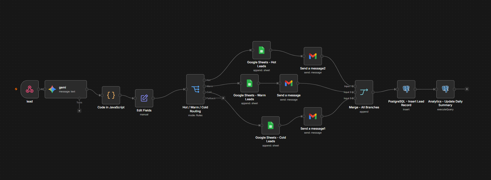
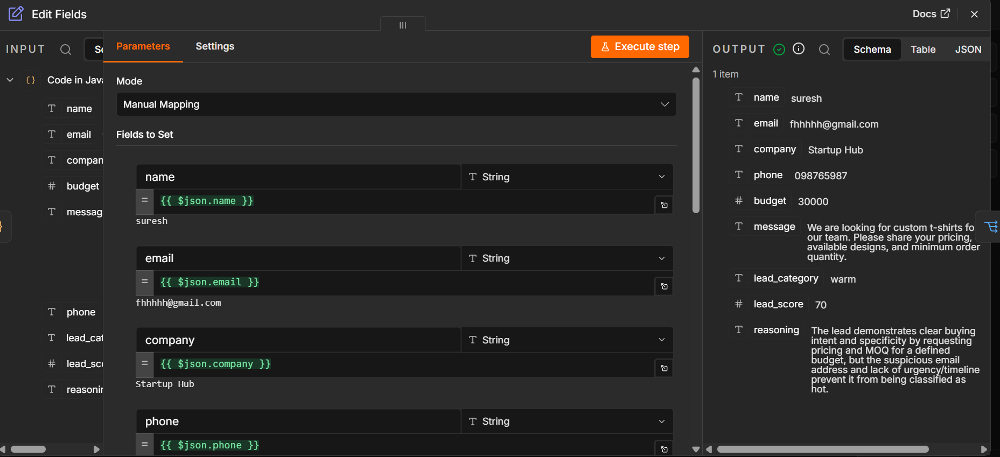
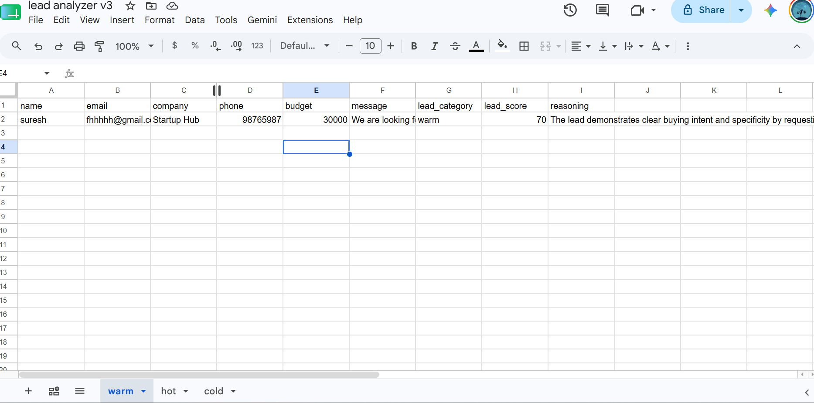
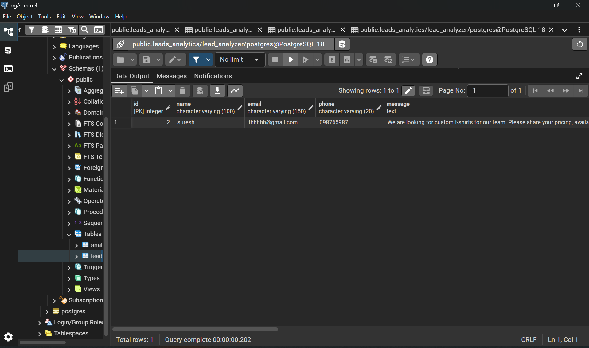
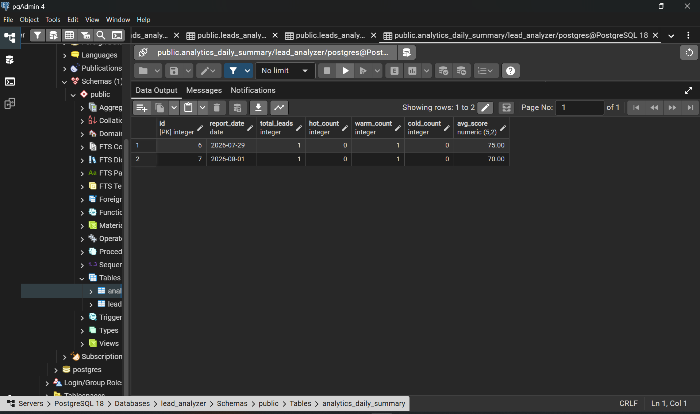

# 🚀 AI Lead Analyzer
<p align="center">
  
</p>
# 🚀 AI Lead Analyzer


An AI-powered lead qualification and sales automation system built using **n8n**, **Google Gemini AI**, **PostgreSQL**, **Google Sheets**, and **Gmail**.

The workflow automatically analyzes incoming leads, assigns AI-generated scores, categorizes them into Hot/Warm/Cold, stores the results, notifies the sales team, and generates analytics reports.

---

# 📌 Project Overview

Businesses receive hundreds of inquiries every month.

Manually reviewing every lead wastes time and often causes sales teams to miss high-value opportunities.

This system automates the entire lead qualification process using AI.

### Key Benefits

✅ AI-powered lead scoring

✅ Hot / Warm / Cold classification

✅ Automated lead routing

✅ Email notifications

✅ Database storage

✅ Daily analytics generation

✅ Zero manual lead review

---

# ⚙ Workflow

```text
Webhook
   │
   ▼
Google Gemini AI
   │
   ▼
Lead Score + Reasoning
   │
   ▼
Lead Routing
 ┌───────┬───────┬───────┐
 ▼       ▼       ▼
Hot     Warm    Cold
 │        │       │
 ▼        ▼       ▼
Google Sheets Storage
 │
 ▼
Email Notifications
 │
 ▼
PostgreSQL Database
 │
 ▼
Daily Analytics Summary
```

---

# 🧠 AI Analysis

Google Gemini evaluates:

- Lead Intent
- Budget
- Urgency
- Company Information
- Purchase Probability

Example Output:

```json
{
  "lead_category": "Warm",
  "lead_score": 70,
  "reasoning": "The lead demonstrates clear buying intent and specificity by requesting pricing and MOQ for a defined budget."
}
```

---

# 📸 Screenshots

## Workflow



---

## Lead Analysis Output



---

## Google Sheets Storage



---

## PostgreSQL Database



---

## Daily Analytics Dashboard



---

# 🛠 Tech Stack

## Automation

- n8n

## AI

- Google Gemini

## Database

- PostgreSQL

## Storage

- Google Sheets

## Notifications

- Gmail

## APIs

- Webhooks
- JSON

---

# 📥 Sample Input

```json
{
  "name": "Suresh",
  "email": "contact@startuphub.com",
  "company": "Startup Hub",
  "phone": "98765987",
  "budget": 30000,
  "message": "We are looking for custom t-shirts for our team. Please share pricing and MOQ."
}
```

---

# 📤 Sample Output

```json
{
  "lead_category": "Warm",
  "lead_score": 70,
  "reasoning": "The lead demonstrates clear buying intent and specificity."
}
```

---

# 🗄 Database Schema

## leads_analytics

| Field | Type |
|---------|---------|
| id | Integer |
| name | Text |
| email | Text |
| company | Text |
| phone | Text |
| budget | Integer |
| message | Text |
| lead_category | Text |
| lead_score | Integer |
| reasoning | Text |
| received_at | Timestamp |

---

## analytics_daily_summary

| Field | Description |
|---------|---------|
| report_date | Daily Report Date |
| total_leads | Total Leads |
| hot_count | Hot Leads |
| warm_count | Warm Leads |
| cold_count | Cold Leads |
| avg_score | Average Score |

---

# 📊 Features

- AI Lead Qualification
- Lead Scoring
- Lead Categorization
- Email Alerts
- Database Storage
- Google Sheets Logging
- Daily Analytics Reporting

---

# 🚀 Future Improvements

- WhatsApp Integration
- Facebook Lead Ads Integration
- CRM Integration
- Dashboard UI
- AI Sales Agent
- Voice Agent
- Slack Notifications
- PDF Reports

---

# 👨‍💻 Author

### Dhinesh

AI Automation Developer

Skills:

- n8n
- Google Gemini
- PostgreSQL
- RAG Systems
- Workflow Automation
- API Integrations

GitHub: https://github.com//dhinesh-k-it
LinkedIn: www.linkedin.com/in/dhinesh-it
